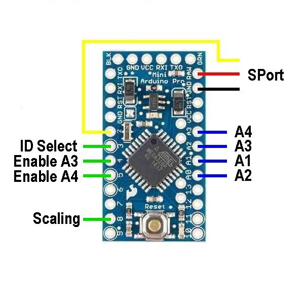
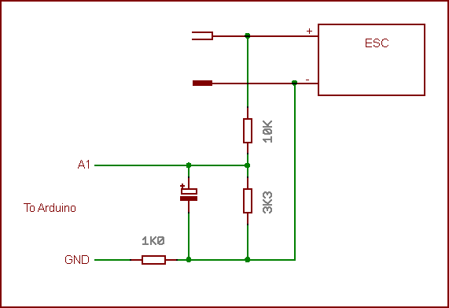

Arduino used to provide analog inputs to FrSky SPort

This is made available to replace the X8R2Analog device that is no longer available.

The Arduino Pro Mini used MUST be a 8MHz, 3.3V version.

The analog inputs accept voltages from 0 to 3.3V only. To measure higher voltages, you must add a resistor divider on each analog input used.

The default operation is to use the first analog input, and this is sent as the A2 value.
The second analog input may also be used. This is auto-detected as in use when it has a voltage less then 3.2V applied. An internal pull up resistor holds the voltage at 3.3V if left unconnected.
By default, this second analog value is returned as Temperature 2, but if the input labelled "ID Select" is connected to ground, the values is returned as A1.

Analog inputs labelled A3 and A4 may also be used, they will only be sent over the SPort if the corresponding "Enable" signal is connected to ground.

The "Scaling" option link operates on the A2 value. If left unconnected, A2 operates normally. If the option is connected to ground, the analog value is scaled.
The X8R2Analog device used a resistor divider of 15K and 3.3K. This is suitable for up to 4S Lipo. If you want to measure only a 3S Lipo, and use this same resistor divider, then grounding the link option causes the measured value to be scaled as though the divider was 10K and 3.3K.

The physical ID default value is 0x1B, as on the X8R2Analog, but with this version you may change it using the ChangeId app accessed from the ersky9x bootloader or the ChangeID option in "Maintenance Mode" of ersky9x.

Connections:

Voltage divider:

This is a suggested method for connecting a voltage divider. With 10K and 3K3 resistors, this is suitable for voltages up to 13.3 volts. For higher voltages, increase the value of the 10K resistor.
The 1K resistor in the ground connection avoids ground loops.

## License and Disclaimer
This software is provided under the GNU v2.0 License. All relevant restrictions apply including the following. In case there is a conflict, the GNU v2.0 License is overriding.
This software is provided as-is in the hope that it will be useful, but WITHOUT ANY WARRANTY; without even the implied warranty of MERCHANTABILITY or FITNESS FOR A PARTICULAR PURPOSE. See the GNU General Public License for more details. In no event will the authors and/or contributors be held liable for any damages arising from the use of this software.

Permission is granted to anyone to use this software for any purpose, including commercial applications, and to alter it and redistribute it freely, subject to the following restrictions:

1. The origin of this software must not be misrepresented; you must not claim that you wrote the original software.
2. If you use this software in a product, an acknowledgment in the product documentation would be appreciated but is not required.
3. Altered versions must be plainly marked as such, and must not be misrepresented as being the original software.
4. This notice may not be removed or altered from any distribution.  

By downloading this software you are agreeing to the terms specified in this page and the spirit of thereof.

